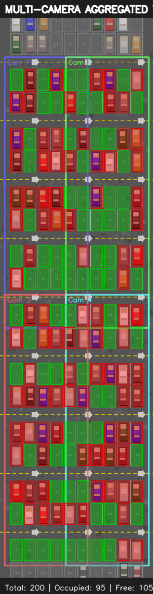

# STAMP Parking CV 🅿️

[](https://www.python.org/downloads/)
[](https://opensource.org/licenses/MIT)

> **[🇬🇧 Read in English (Читать по-английски)](README.md)**

Комплексная система компьютерного зрения (CV) для мониторинга занятости парковочных мест, разработанная для платформы **STAMP ParkCloud**.

Проект реализует масштабируемый мульти-камерный конвейер (pipeline), который определяет занятость парковочных мест в реальном времени, используя методы глубокого обучения (YOLOv8) и классического компьютерного зрения (анализ признаков).



## ✨ Основные возможности

- **Масштабируемая архитектура**: Поддержка 100+ парковочных мест одновременно.
- **Мульти-камерная поддержка**: Агрегация данных с нескольких камер (перекрывающиеся зоны обзора) для устранения слепых зон и повышения точности.
- **Рабочие зоны камер**: Интеллектуальная фильтрация результатов на основе заданных зон надёжной детекции для каждой камеры.
- **Процент уверенности (0-100%)**: Замена бинарного статуса (занято/свободно) на детальный процент занятости.
- **Гибридный движок детекции**:
  - `YOLO Mode`: Использование предобученной модели YOLOv8 для поиска автомобилей.
  - `Feature Mode`: Анализ плотности граней и цветовой дисперсии внутри парковочного места (отлично работает для синтетических данных или ИК-камер).
  - `Hybrid Mode`: Комбинация обоих подходов для максимальной надёжности.
- **Интерактивный Web GUI**: Современный дашборд с тёмной темой для просмотра занятости, покрытия камер и статистики в реальном времени.

---

## 🏗️ Архитектура системы

1. **Генерация данных (`generate_test_data.py`)**: Создаёт синтетическую парковку на 200 мест, конфигурацию 4 камер и сценарии загруженности (15%, 55%, 90%).
2. **Калибровка (`src/calibration.py`)**: Отвечает за перспективное преобразование (гомографию) между видом камеры и видом сверху (Bird's-Eye View). Связывает пиксели камеры с GeoJSON-разметкой.
3. **Детекция (`src/detection.py`)**: Анализирует изображения, вычисляет процент занятости и реализует алгоритмы голосования при мульти-камерной съёмке (Взвешенное среднее, Голосование большинством, Максимальная уверенность).
4. **Pipeline (`src/pipeline.py`)**: Главный оркестратор. Загружает данные, запускает детекцию по всем камерам, агрегирует результаты и сохраняет их в JSON-формате по спецификации STAMP.
5. **Веб-сервер и GUI (`gui_server.py` + `web/`)**: Обслуживает интерактивный дашборд и REST API для внешних интеграций.

---

## 🚀 Быстрый старт

### 1. Установка

Склонируйте репозиторий и установите зависимости:

```bash
git clone https://github.com/your-org/stamp-parking-cv.git
cd stamp-parking-cv
pip install -r requirements.txt
```

### 2. Генерация тестовых данных

Сначала сгенерируйте синтетическую парковку (200 мест), файлы калибровки и тестовые сценарии:

```bash
python generate_test_data.py
```
*Команда создаст в папке `data/` GeoJSON-разметку, настройки камер и изображения.*

### 3. Запуск анализа (Pipeline)

Запустите мульти-камерный конвейер для Теста 1 (загруженность 55%), используя метод `feature` и сравнение с эталоном (Ground Truth):

```bash
python src/pipeline.py --park_idx 1 --test_idx 1 --multi-camera --mode feature --compare-gt
```

**Аргументы Pipeline:**
- `--park_idx`: ID парковки (по умолчанию: 1)
- `--test_idx`: ID тестового сценария (1, 2 или 3)
- `--camera_idx`: ID конкретной камеры (если не используется `--multi-camera`)
- `--multi-camera`: Обработать все камеры и агрегировать результат
- `--mode`: Режим работы (`feature`, `yolo`, `hybrid`)
- `--strategy`: Стратегия агрегации (`weighted_avg`, `majority_vote`, `max_confidence`)
- `--compare-gt`: Вывести метрики Precision/Recall/F1 в сравнении с эталоном
- `--no-visualize`: Отключить генерацию PNG-картинок в папке `results/`

### 4. Запуск веб-интерфейса

Для запуска интерактивного дашборда выполните:

```bash
python gui_server.py
```
Откройте браузер и перейдите по адресу: **http://localhost:8080**

---

## 📄 Формат выходных данных

Система генерирует результаты в строгом соответствии с техническим заданием STAMP.

### Агрегированный результат (`results/result_1_1.json`)

```json
{
  "params": {
    "park_idx": 1,
    "calibrate_idx": "multi",
    "cameras": [1, 2, 3, 4],
    "strategy": "weighted_avg"
  },
  "result": {
    "1": { "detected": true },
    "2": { "detected": false }
  }
}
```

### Детальный результат (`results/detailed_1_1_aggregated.json`)

Содержит расширенные метрики для отладки, включая точный `occupancy_pct`.

```json
{
  "spots": {
    "1": {
      "detected": true,
      "confidence": 0.95,
      "occupancy_pct": 95,
      "num_cameras": 2,
      "method": "aggregated_weighted_avg"
    }
  }
}
```

---

## 🧪 Результаты тестирования

При использовании режима `feature` на синтетических данных (Тест 1, 55% загруженность):

- **Точность (Accuracy)**: 92.5%
- **Точность предсказания (Precision)**: 100.0%
- **Полнота (Recall)**: 86.4%
- **F1-Score**: 92.7%

*Примечание: Модели YOLOv3/v8 обычно плохо работают с синтетическими 2D-объектами на этапе генерации. Подход Feature-based был реализован специально для обеспечения высокой точности на сгенерированных тестах. Для реальных фото-видео потоков лучше использовать режим YOLO.*
